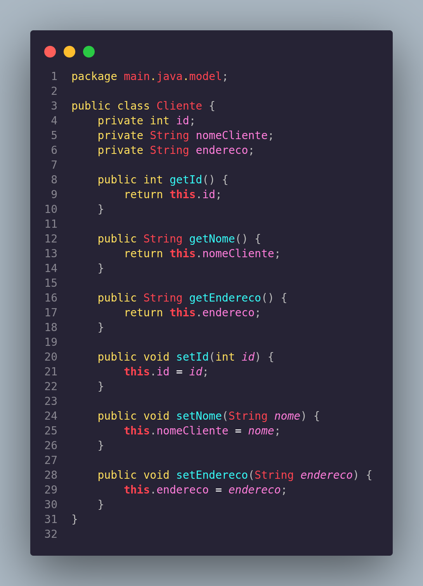
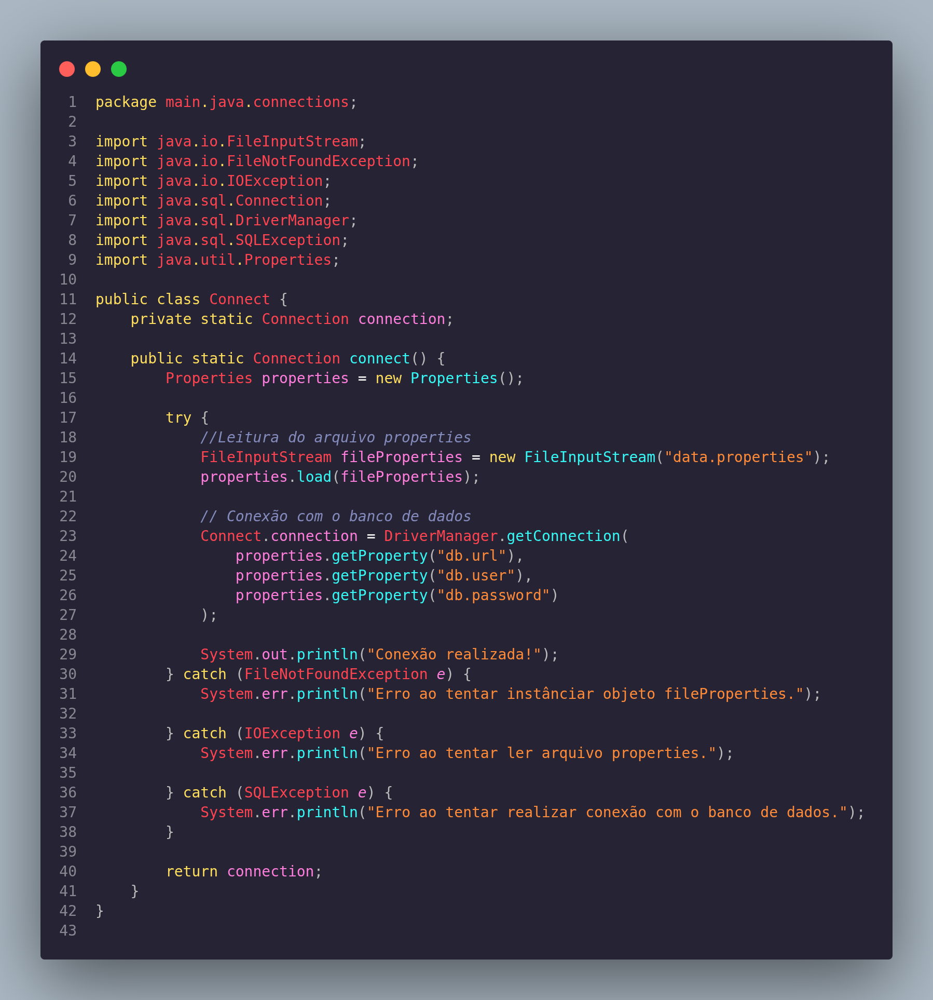
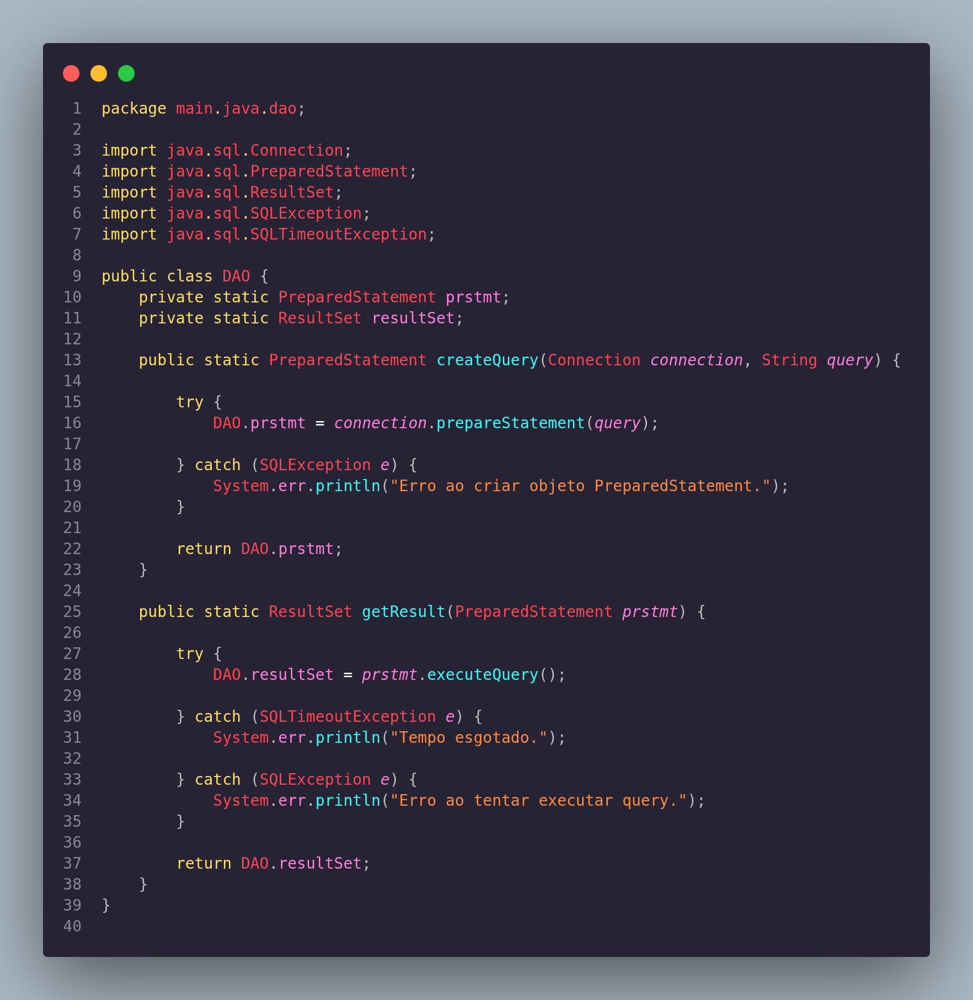
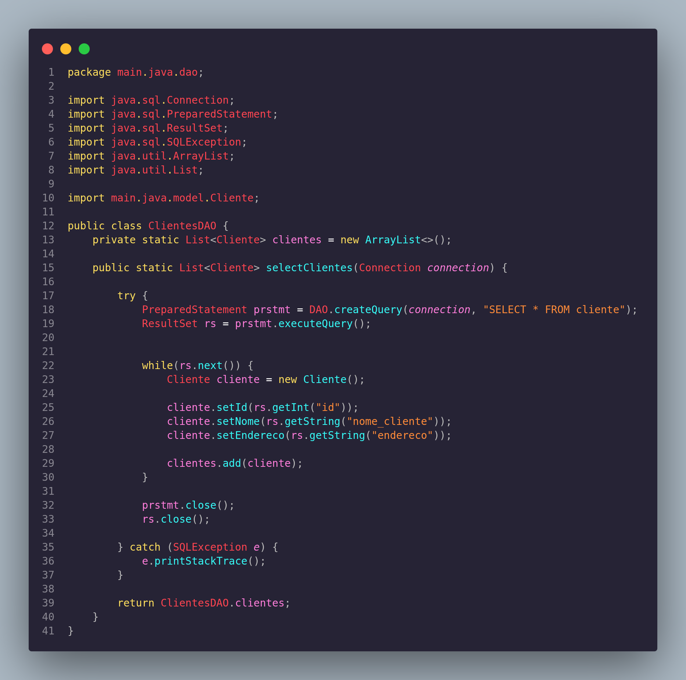

# Projeto CLI

Criação de um CLI (Command Line Interface) para manipular dados em um banco de dados. Você pode usar o Driver do SGBD de sua preferência, basta instalar e copiá-lo para o diretório **[lib](lib/)**.

Até o momento apenas 4 classes funcionam. São elas: **[Cliente.java](src/main/java/model/Cliente.java)**, **[Connect.java](src/main/java/connections/Connect.java)**, **[DAO.java](src/main/java/dao/DAO.java)**, **[ClienteDAO.java](src/main/java/dao/ClientesDAO.java)**

### Cliente.java:

Essa classe é uma classe POJO, vai receber os dados do banco de dados.

### Connect.java:

Essa classe foi feita para reutilização, ou seja, para não precisa passar url, usuario e senha para conectar ao banco de dados. Sempre que precisar fazer a conexão é necessário chamá-la.

### DAO.java:

Essa classe possui as mesmas características da classe Connect, foi criada para reutilização, porém não para conexão, mas para enviar querys e retornar os resultados (dados) do banco. **DAO** significa *Data Acess Object*.

### ClienteDAO.java:

Essa classe vai ser o intermediador entre o banco de dados e a classe Cliente, fazendo com que ela pegue os dados do banco, instâncie um objeto da classe Cliente e insere os dados nesse objeto. Aqui ficará quaisquer funções relacionadas a consultas e afins.

# Como compilar e executar

## Compilando
Para compilar qualquer classe que dependa do Driver para funcionar você pode executar o comando:

`javac -cp .:lib/(seu-driver.jar) *.java -d bin`

Aqui eu coloquei o arquivo .class na pasta `bin`.

Esse código se trata de um exemplo e não deve ser levado como regra já que vai depender de como seu projeto está organizado e de como você pretende organizá-lo.

## Executando
A lógica é a mesma da compilação, mudando poucos detalhes:

`java -cp bin:lib/(seu-driver.jar) Main`

Aqui trocamos o diretório raíz `.` pela pasta `bin`, onde se encontra nossa classe executável `Main.class`. 